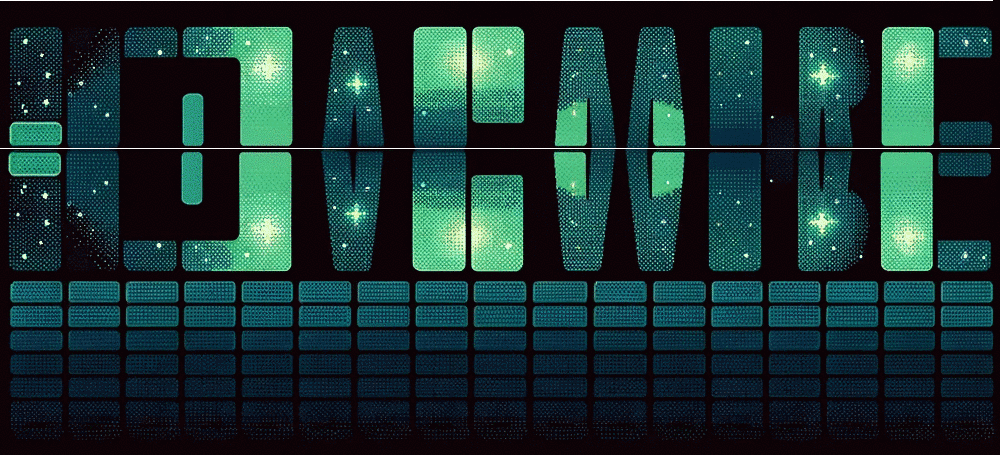

## Hi, I'm alone-ai7 👋

## My real name is Elijah!

IT student with a goal: land at a top game studio.
Valve, Capcom, Rockstar — I'm working toward it.

## 🕹️ CHARACTER STATS
*   **Class:** First-Year BSIT Student / Beginner Game Developer 🛠️
*   **Current Quest:** Mastering Object-Oriented Programming (OOP) & 2D Game Architecture 👾
*   **Playstyle:** Pure Trial & Errors, heavy focus on Socratic learning and breaking code to understand the engine.
*   **Passives:** 
    *   ⚡ **High-Speed Debugging:** Instantly detects anomalies and structural logic errors in source code.
    *   🦉 **Night Owl Dev:** Performance multipliers peak during late-night programming sessions.

---

## 🎒 INVENTORY (TECH STACK & TOOLS)

### ⚔️ Primary Weapons (Languages)
*   **Python** (The Foundation | Core Project Base)
*   **C++** (The Speed | Low-Level Logic Study)
*   **Java & C#** (The Structure | Academic Track)
*   **GDScript** (The Fluidity | Godot Mechanics)

### 🛠️ Crafting Tools (Software & Environments)
*   **Notepad++** (Lightweight Text Execution via Command Line 💻)
*   **Godot Engine 3.5.3** (2D Game Assembly)
*   **Pygame** (OOP Framework Experimentation)
*   **Adobe Photoshop** (Asset Manipulation & Layouts)

---

## 🏆 ACTIVE QUEST LOG (CURRENT PROJECTS)

### 🚀 [WIP] Alien Invasion (Pygame / Python Crash Course)
*   *Objective:* Build a functional, 2D space shooter using OOP principles from Eric Matthes' textbook.
*   *Features:* Implements keyboard movement arrays, class-based firing mechanics, and responsive screen-bound handling.

### 🟩 [WIP] Flappy Bird Clone (Godot 3.5.3)
*   *Objective:* Learn the full game dev pipeline, physics formulas, and random obstacle generation.
*   *Features:* Designed with a separate academic research paper and dedicated raw node scripts repository for architecture documentation.

### 🐍 [QUEUED] Snake Game (Pygame)
*   *Objective:* Transition from procedural logic to complex OOP structures (Classes, Instances, and Inheritance).

---

## 🕵️‍♂️ SYSTEMS LAB (REVERSE ENGINEERING & QA)
*   **Current Focus:** Deep-diving into production titles to analyze game logic, spatial algorithms, and edge-case exploits.
*   **Methodology:** 📝 **Pure Analytical Observation** — Deconstructing complex engine behavior, diagnosing rendering bottlenecks, and documenting mechanical flaws entirely through technical summaries, architecture breakdowns, and post-mortems. 
*   *Note: This laboratory contains zero source code—focusing strictly on architectural case studies and logical teardowns.*

### 🧪 [game-teardown](https://github.com/alone-ai7/game-teardown)
*   *Objective:* Documenting architectural design patterns and structural flaws discovered during live gameplay.
*   *Active Analysis Tracks:*
    *   🔍 **State-Machine Logic:** Breaking down systemic rules and player stress tracking modules.
    *   🐛 **Collision & Pathfinding Exploits:** Diagnosing bounding box clipping errors and boundary computation freezes.
    *   ⚙️ **Tick-Rate Desynchronization:** Investigating input latency drops and spatial simulation discrepancies.

---

### What I'm into
- 🎮 Game development
- 🔐 Cybersecurity
- 🌐 Web-development
- 🐛 Debugging

### Currently
- 🌱 First open source contributions
- 📚 Learning the game dev pipeline

### Contact

Open an issue on any of my repositories, or start a discussion. Or simply tap any of my social media accounts and message me. That is the fastest way to reach me.
For anything about a specific repository, please use that repository's issue tracker rather than emailing. Context lives better next to the code.

### Stats   
  
   
    

       

  

  

  

