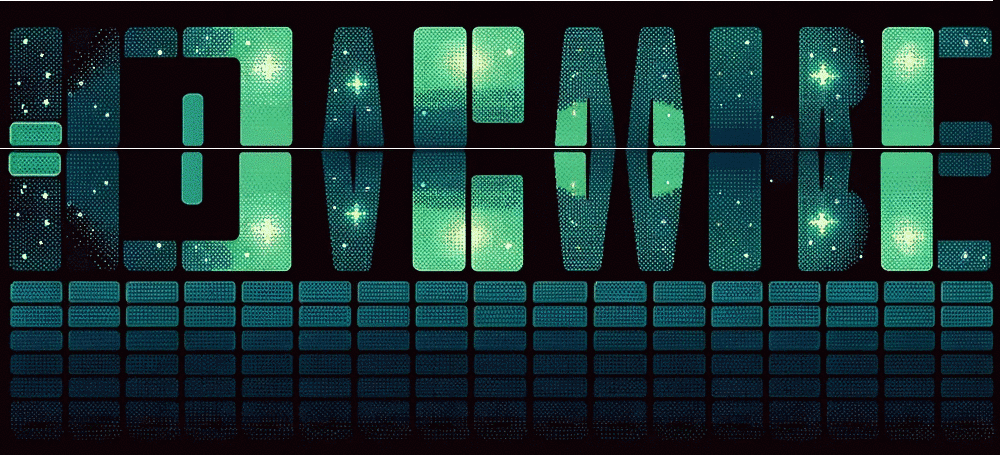

  

## My real name is Elijah!

I am a first-year college student learning the fundamentals of programming. My dream is to work my way up to major game studios like **Valve, Capcom, and Rockstar** one day. Right now, I'm ignoring the flashy design stuff and focusing entirely on learning how game loops, code logic, and basic game mechanics function behind the scenes. 

I use this GitHub to document my progress, keep track of my scripts, and log my practice runs.

---

## 🕹️ CHARACTER STATS

*   **Class:** Beginner Game Developer 🛠0️⃣
*   **Current Quest:** Figuring out Object-Oriented Programming (OOP) & 2D game setups.
*   **Playstyle:** Heavy trial-and-error. I learn best by reading documentation, manually typing out code, and intentionally breaking scripts to understand what each line actually does.
*   **Passives:** 
    *   ⚡ **Spotting Bugs:** Fast at tracking typos and minor logic blocks when things crash.
    *   🦉 **Night Coding:** Most productive when compiling and debugging late at night.

---

## 🎒 INVENTORY (WHAT I'm USING)

### ⚔️ Languages I'm Practicing
*   **Python:** The language I'm currently using at school and for basic logic exercises.
*   **GDScript:** What I use to test out movement and node mechanics inside Godot.
*   **Java, C#, & C++:** Languages I'm studying independently to understand syntax rules.

### 🛠️ Software & Environments
*   **Notepad++ & CMD:** My preferred lightweight text editor to type scripts manually and run them directly through the command line.
*   **Godot Engine (3.5.3):** Using it to learn how scenes, nodes, and positions link together in 2D.
*   **Pygame Library:** Helping me understand how a raw game loop handles rectangle updates and inputs.
*   **Adobe Photoshop CS3:** For editing text layouts or quick image modifications.

---

## 🏆 QUEST LOG (MY PRACTICE PROJECTS)

### 🟩 Flappy Bird Clone (Godot 3.5.3) — `[WIP]`
*   *What I'm learning:* Pacing delta-time formulas, random pipe generation, and managing separate scripts for clean repository storage.

### 🚀 Alien Invasion (Pygame) — `[WIP]`
*   *What I'm learning:* Putting textbook OOP theories into practice by tracking screen boundaries, input arrays, and moving objects.

---

## 🕵️‍♂️ SYSTEMS LAB (OBSERVATIONS & TEARDOWNS)

### 🧪 [game-teardown](https://github.com)
*   **Goal:** A repository where I analyze existing games to study how they handle boundaries, gameplay algorithms, or weird visual bugs.
*   **Rule:** This is a code-free zone. It’s strictly my personal journal of rough notes, gameplay breakdowns, and structural summaries to help train my developer mindset.

---

## 📬 CONTACT

*   **Issues & Discussions:** If you want to talk about a project, please open an issue or start a thread directly inside that repository so the conversation stays next to the relevant files.
*   **Direct Message:** For general chats, reaching out via my social media links is the fastest method.

---

### Stats   
  
 

       

  

